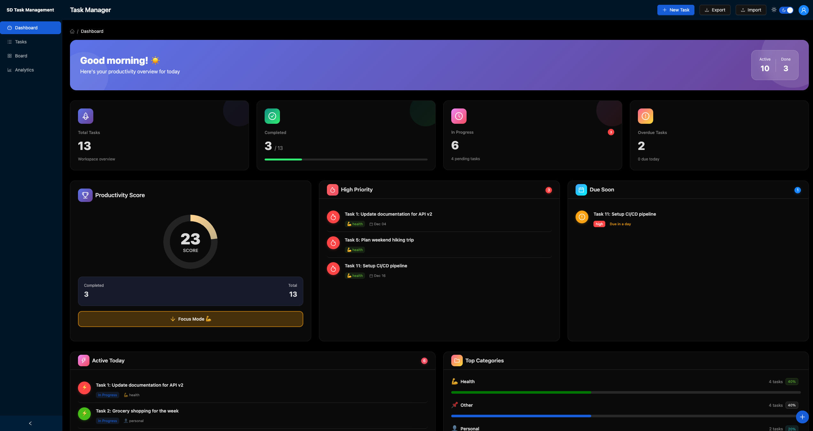
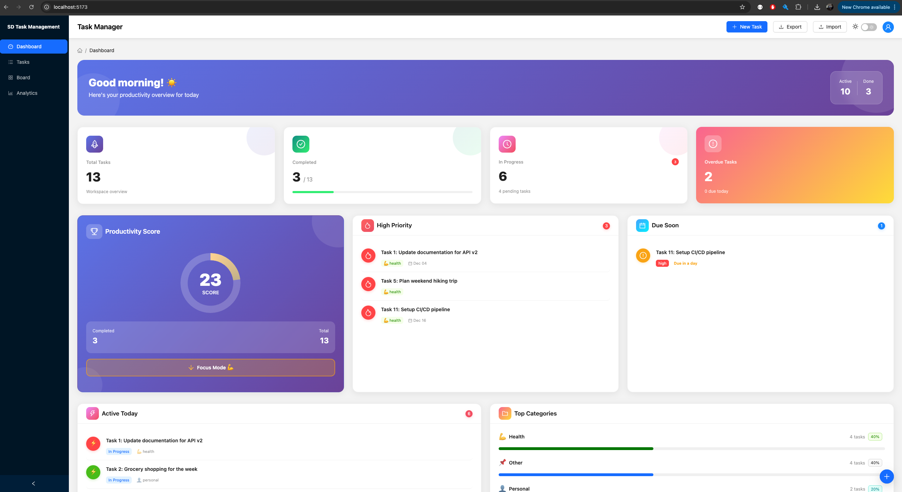
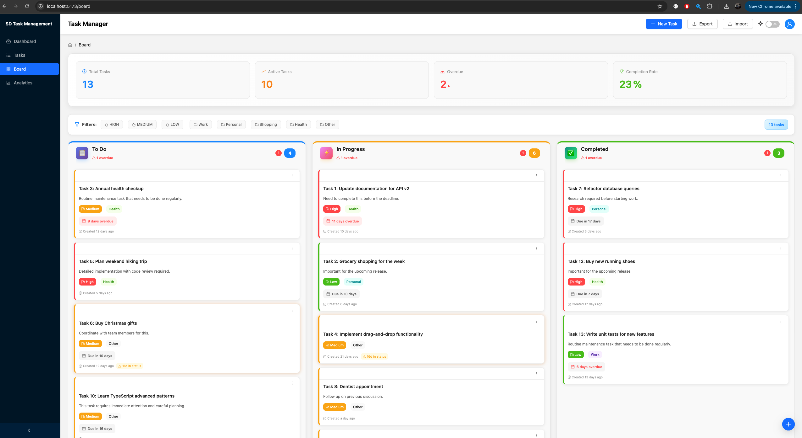
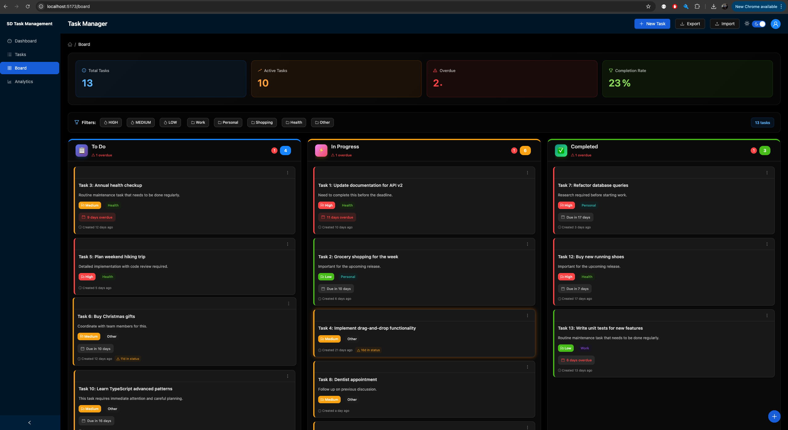
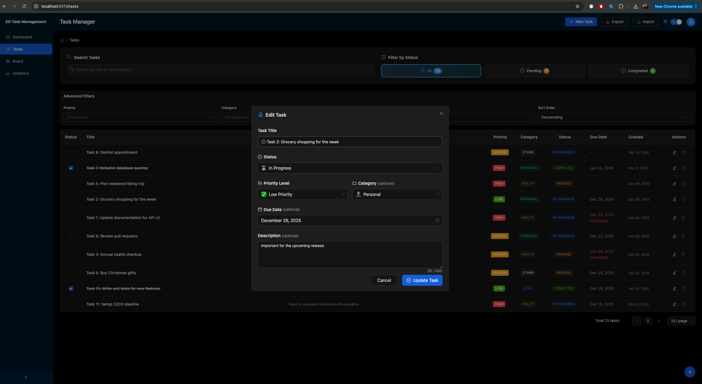
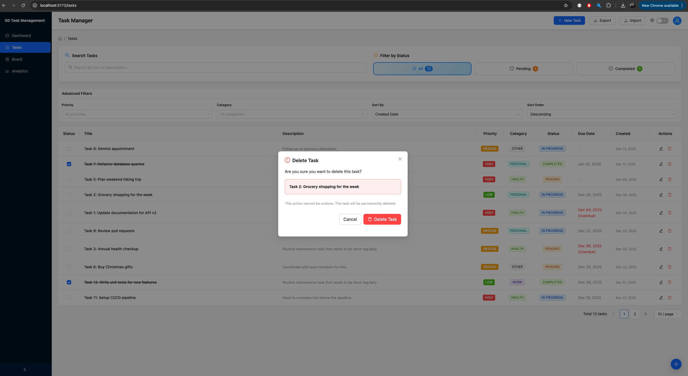
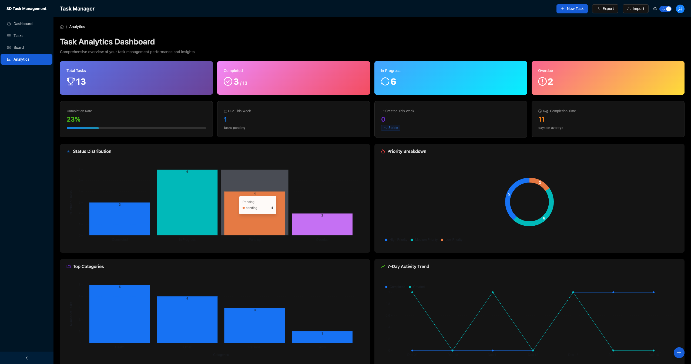

# 📋 Task Management Dashboard

A modern, full-stack task management application with beautiful UI, drag-and-drop Kanban board, analytics, and advanced filtering capabilities. Built with React, TypeScript, NestJS, and Ant Design.

[](https://www.typescriptlang.org/)
[](https://reactjs.org/)
[](https://nestjs.com/)
[](https://ant.design/)

---

## 🚀 Quick Start

### One-Command Setup & Run

```bash
# Install all dependencies and start both servers
npm run install:all && npm run dev
```

Then open **[http://localhost:5173](http://localhost:5173)** in your browser!

- 🖥️ **Frontend**: `http://localhost:5173`
- 🔌 **Backend API**: `http://localhost:3001`

---

## ✨ Features

### 🎯 Core Functionality
- ✅ **Create, Edit, Delete** tasks with full CRUD operations
- ✅ **Task Properties**: Title, description, priority, category, due date, status
- ✅ **Smart Filtering**: Search by keywords, filter by status/priority/category
- ✅ **Real-time Updates**: Instant feedback with loading states and notifications
- ✅ **Data Persistence**: All tasks saved to JSON file storage

### 🎨 Views & Interfaces
- 📊 **Dashboard** - Overview with statistics, recent activity, and quick stats
- 📝 **Task List** - Table view with pagination, search, and advanced filters
- 🎯 **Kanban Board** - Drag-and-drop interface with column statistics
- 📈 **Analytics** - Charts and insights for task metrics

### 🌙 Advanced Features
- 🎨 **Dark Mode** - Full dark theme support across all views
- 🎯 **Priority Management** - High/Medium/Low with color coding
- 📂 **Categories** - Work, Personal, Shopping, Health, Other
- 📅 **Due Dates** - Track deadlines with overdue indicators
- ⏱️ **Aging Indicators** - Visual warnings for stale tasks
- 📥 **Import/Export** - JSON export and import functionality
- 🔄 **Server-side Pagination** - Efficient data handling
- ⌨️ **Keyboard Accessible** - Full keyboard navigation support

---

## 📸 Screenshots

### Dashboard View

<div align="center">


#### Dark Mode

*Beautiful dark theme with gradient effects and modern styling*

</div>

---

### Task List View

<div align="center">

#### Dark Mode

*Task list in dark mode with advanced filtering capabilities*

</div>

---

### Kanban Board View

<div align="center">

#### Light Mode

*Drag-and-drop Kanban board with statistics, quick filters, and enhanced column insights*

#### Dark Mode

*Kanban board with beautiful gradients and hover effects in dark mode*

</div>

---

### Task Management Modals

<div align="center">

#### Edit Task Modal (Dark Mode)

*Comprehensive task editing with all fields - priority, category, due date, and description*

#### Delete Confirmation (Light Mode)

*Safe deletion with confirmation dialog to prevent accidental data loss*

</div>

---

### Analytics Dashboard

<div align="center">


*Comprehensive analytics with charts for category distribution, priority breakdown, and status overview*

</div>

---

## 🛠️ Technology Stack

### Frontend
| Technology | Description |
|-----------|-------------|
| **React 19** | Modern UI framework with hooks |
| **TypeScript** | Type-safe development |
| **Ant Design 5.x** | Enterprise-grade UI components |
| **Vite** | Lightning-fast build tool |
| **DnD Kit** | Drag-and-drop for Kanban board |
| **Recharts** | Beautiful charts for analytics |
| **dayjs** | Date manipulation library |

### Backend
| Technology | Description |
|-----------|-------------|
| **NestJS 10** | Progressive Node.js framework |
| **TypeScript** | Type-safe backend |
| **Express** | HTTP server (built into NestJS) |
| **class-validator** | DTO validation decorators |
| **class-transformer** | Object transformation |
| **File-based Storage** | JSON persistence |

---

## 📦 Installation & Setup

### Prerequisites
- Node.js 18+ installed
- npm or yarn package manager

### Step 1: Clone Repository
```bash
git clone <repository-url>
cd Task-Management
```

### Step 2: Install Dependencies

**Option A: All at Once (Recommended)**
```bash
npm run install:all
```

**Option B: Manual Installation**
```bash
# Install root dependencies
npm install

# Install backend dependencies
cd backend && npm install && cd ..

# Install frontend dependencies
cd frontend && npm install && cd ..
```

### Step 3: Start Development Servers

**Option A: Concurrent Mode (Recommended) ⭐**
```bash
npm run dev
```
This starts both backend and frontend with a single command!

**Option B: Separate Terminals**

Terminal 1 - Backend:
```bash
cd backend
npm run dev
```

Terminal 2 - Frontend:
```bash
cd frontend
npm run dev
```

### Step 4: Access the Application
Open your browser and navigate to:
- **Frontend**: [http://localhost:5173](http://localhost:5173)
- **Backend API**: [http://localhost:3001](http://localhost:3001)

---

## 🎮 Usage Guide

### Creating Tasks
1. Click the **"+ Create Task"** button in the header
2. Fill in the form:
   - **Title** (required)
   - **Description** (optional)
   - **Priority** (High/Medium/Low)
   - **Category** (Work/Personal/Shopping/Health/Other)
   - **Due Date** (optional)
3. Click **"Create"** to save

### Managing Tasks

#### On Dashboard
- View statistics and recent activity
- Quick overview of completion rate
- See this week's created and completed tasks

#### On Task List
- **Search**: Type in the search bar to filter by title/description
- **Filter by Status**: All, Pending, or Completed
- **Advanced Filters**: Filter by priority and category
- **Edit**: Click the edit icon on any task
- **Delete**: Click the delete icon (with confirmation)
- **Complete**: Check the checkbox to mark as done

#### On Kanban Board
- **Drag & Drop**: Move tasks between columns (To Do, In Progress, Completed)
- **Quick Filters**: Click priority or category tags to filter
- **View Stats**: Hover over column count badges to see priority breakdown
- **Overdue Warnings**: Red badges show overdue tasks per column
- **Aging Indicators**: Orange glow on tasks stuck in same status for 7+ days

#### On Analytics
- View distribution charts for categories and priorities
- Track status overview with pie chart
- Monitor completion trends

### Keyboard Navigation
- `Tab` - Navigate between elements
- `Enter` - Submit forms, activate buttons
- `Esc` - Close modals
- `Space` - Toggle checkboxes

---

## 🔌 API Documentation

### Base URL
```
http://localhost:3001/api
```

### Endpoints

#### `GET /api/tasks`
Get all tasks with optional pagination
```bash
curl http://localhost:3001/api/tasks?page=1&pageSize=10
```

**Response:**
```json
{
  "data": [...],
  "meta": {
    "page": 1,
    "pageSize": 10,
    "total": 45,
    "totalPages": 5
  }
}
```

#### `GET /api/tasks/:id`
Get a single task by ID
```bash
curl http://localhost:3001/api/tasks/1
```

#### `POST /api/tasks`
Create a new task
```bash
curl -X POST http://localhost:3001/api/tasks \
  -H "Content-Type: application/json" \
  -d '{
    "title": "Complete project",
    "description": "Finish the task management app",
    "priority": "high",
    "category": "work",
    "dueDate": "2025-12-20"
  }'
```

#### `PUT /api/tasks/:id`
Update an existing task
```bash
curl -X PUT http://localhost:3001/api/tasks/1 \
  -H "Content-Type: application/json" \
  -d '{
    "status": "completed"
  }'
```

#### `DELETE /api/tasks/:id`
Delete a task
```bash
curl -X DELETE http://localhost:3001/api/tasks/1
```

---

## 📁 Project Structure

```
Task-Management/
├── backend/                          # NestJS Backend
│   ├── src/
│   │   ├── tasks/
│   │   │   ├── dto/                  # Data Transfer Objects
│   │   │   │   ├── create-task.dto.ts
│   │   │   │   ├── update-task.dto.ts
│   │   │   │   └── pagination-query.dto.ts
│   │   │   ├── task.entity.ts        # Task interface and enums
│   │   │   ├── tasks.controller.ts   # REST API endpoints
│   │   │   ├── tasks.service.ts      # Business logic
│   │   │   └── tasks.module.ts       # NestJS module
│   │   ├── data/
│   │   │   └── tasks.json            # JSON file storage
│   │   ├── app.module.ts
│   │   └── main.ts
│   └── test/                         # Tests (124 tests, 75% coverage)
│
├── frontend/                         # React + Ant Design Frontend
│   ├── src/
│   │   ├── components/
│   │   │   ├── Dashboard.tsx         # Dashboard view
│   │   │   ├── TaskList.tsx          # Table view
│   │   │   ├── KanbanBoard.tsx       # Drag-and-drop board
│   │   │   ├── TaskStatistics.tsx    # Analytics charts
│   │   │   ├── TaskFilters.tsx       # Search & filters
│   │   │   ├── AdvancedFilters.tsx   # Priority/category filters
│   │   │   ├── TaskModal.tsx         # Create/edit modal
│   │   │   └── ...
│   │   ├── hooks/
│   │   │   ├── useTasks.ts           # Task CRUD operations
│   │   │   ├── useTaskFilters.ts     # Filter logic
│   │   │   └── useTaskImportExport.ts
│   │   ├── services/
│   │   │   └── api.ts                # API service layer
│   │   ├── types/
│   │   │   └── task.ts               # TypeScript interfaces
│   │   └── App.tsx
│
├── images/                           # Screenshots for README
├── PRODUCT_DECISIONS.md              # Design decisions & technical debt
└── README.md                         # This file
```

---

## 🧪 Testing

### Backend Tests
```bash
cd backend
npm run test           # Run all tests
npm run test:watch     # Watch mode
npm run test:cov       # Coverage report
```

**Test Coverage**: 75.46% (124 tests)
- ✅ Service layer tests
- ✅ Controller tests
- ✅ DTO validation tests
- ✅ Integration tests

### Manual Testing Checklist
- [x] Create task with all fields
- [x] Edit task
- [x] Delete task with confirmation
- [x] Mark task as complete
- [x] Search functionality
- [x] Filter by status
- [x] Filter by priority
- [x] Filter by category
- [x] Pagination
- [x] Drag-and-drop on Kanban
- [x] Import/export tasks
- [x] Dark mode toggle
- [x] Form validation

---

## 🎨 Design Highlights

### Modern UI/UX
- **Gradient backgrounds** and smooth transitions
- **Hover effects** with subtle animations
- **Color-coded priorities**: Red (High), Orange (Medium), Blue (Low)
- **Visual indicators** for overdue tasks
- **Loading states** with skeletons
- **Toast notifications** for user feedback

### Accessibility
- ✅ Keyboard navigation
- ✅ ARIA labels
- ✅ Focus management
- ✅ Screen reader friendly
- ✅ High contrast in dark mode

### Responsive Design
- Works on desktop, tablet, and mobile
- Adaptive layouts with Ant Design Grid
- Touch-friendly on mobile devices

---

## 🚀 Available Scripts

### Root Scripts
```bash
npm run install:all       # Install all dependencies
npm run dev              # Start both servers
npm run dev:backend      # Start only backend
npm run dev:frontend     # Start only frontend
npm run build            # Build both for production
```

### Backend Scripts
```bash
npm run dev              # Development with watch mode
npm run build            # Build for production
npm run start:prod       # Start production server
npm run test             # Run tests
npm run test:cov         # Test coverage
```

### Frontend Scripts
```bash
npm run dev              # Development server
npm run build            # Production build
npm run preview          # Preview production build
npm run lint             # Run ESLint
```

---

## 🐛 Troubleshooting

### Port Already in Use
If port 3001 or 5173 is already in use:

**Backend:**
```bash
# Find process using port 3001
lsof -i :3001
# Kill it
kill -9 <PID>
```

**Frontend:**
Vite will automatically try the next available port.

### Cannot Connect to Backend
1. Ensure backend is running on port 3001
2. Check browser console for CORS errors
3. Verify API URL in `frontend/src/services/api.ts`

### TypeScript Errors
```bash
# Clear cache and reinstall
rm -rf node_modules package-lock.json
npm install
```

---

## 📚 Documentation

- **[PRODUCT_DECISIONS.md](./PRODUCT_DECISIONS.md)** - Technical decisions, architecture, and trade-offs
- **[Backend API Tests](./backend/src/tasks/)** - Comprehensive test suite
- **[Frontend Components](./frontend/src/components/)** - Reusable React components

---

## 🎯 Future Enhancements

- [ ] User authentication & authorization
- [ ] PostgreSQL/MongoDB database integration
- [ ] Real-time collaboration with WebSockets
- [ ] Task comments and attachments
- [ ] Email/push notifications
- [ ] Subtasks and checklists
- [ ] Time tracking
- [ ] Team workspaces
- [ ] Mobile app (React Native)
- [ ] Advanced analytics with AI insights

---

## 👨‍💻 Development

### Code Quality
- **TypeScript** strict mode enabled
- **ESLint** for code linting
- **Prettier** for code formatting (backend)
- **Class-validator** for DTO validation
- **Comprehensive tests** with 75%+ coverage

### Best Practices
- ✅ Separation of concerns (Controller/Service/DTO)
- ✅ Dependency injection
- ✅ Error handling with proper HTTP status codes
- ✅ Input validation on both frontend and backend
- ✅ Type safety throughout the stack
- ✅ Reusable components
- ✅ Custom hooks for logic reuse

---

## 📄 License

MIT License - feel free to use this project for learning or as a template for your own applications.

---

## 🙏 Acknowledgments

Built with modern best practices using:
- [React](https://reactjs.org/) - UI framework
- [NestJS](https://nestjs.com/) - Backend framework
- [Ant Design](https://ant.design/) - UI component library
- [Vite](https://vitejs.dev/) - Build tool
- [TypeScript](https://www.typescriptlang.org/) - Type safety

---

<div align="center">

**Made with ❤️ using React, NestJS, and TypeScript**

⭐ Star this repository if you find it helpful!

</div>
